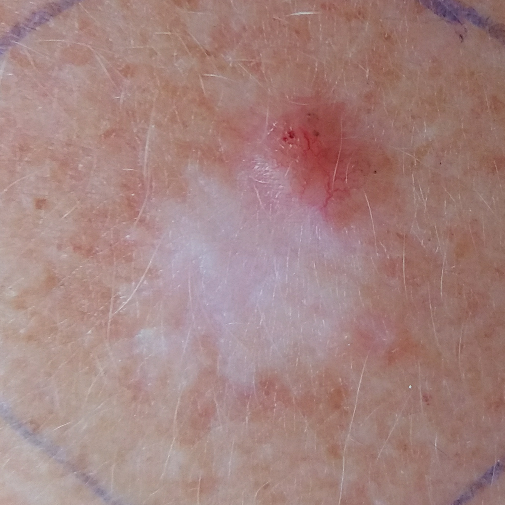

# MedAssist AI Backend Architecture & Implementation Report

This document details the backend architecture, machine learning pipeline, API endpoints, preprocessing workflows, and Docker deployment optimizations of the **MedAssist AI (V6.0)** system. This report is structured for inclusion in a graduation thesis (**Projet de Fin d'Études - PFE**).

---

## 1. System Overview

**MedAssist AI** is a multimodal deep learning backend designed for automated skin lesion diagnosis and clinical risk assessment. It processes a high-resolution dermoscopy image alongside 7 clinical patient metadata fields. 

The backend is built with **FastAPI** for high-performance asynchronous request handling and **PyTorch** for neural network inference.

### Diagnostic Classes (6-Class Classification)
The model classifies skin lesions into one of the following categories:
*   **NEV**: Nevus (Benign)
*   **SEK**: Seborrheic Keratosis (Benign)
*   **ACK**: Actinic Keratosis (Pre-cancerous / Malignant potential)
*   **BCC**: Basal Cell Carcinoma (Malignant)
*   **SCC**: Squamous Cell Carcinoma (Malignant)
*   **MEL**: Melanoma (Highly Malignant)

---

## 2. Advanced Preprocessing Pipeline (Image & Metadata)

To guarantee high diagnostic accuracy and model robustness, the backend executes a rigorous preprocessing pipeline before feeding the inputs to the neural network.

```
[Raw Uploaded Image]
       │
       ▼
 1. Lanczos Resize (256x256)
       │
       ▼
 2. Shades-of-Gray Constancy (power=6)
       │
       ▼
 3. DullRazor Hair Removal (kernel=17)
       │
       ▼
 4. CLAHE Local Contrast Enhancement
       │
       ▼
 5. ImageNet Normalisation
       │
       ▼
[Processed Image Tensor (1, 3, 256, 256)]
```

### 2.1. Image Preprocessing Steps
1.  **Resize**: The uploaded image is resized to $256 \times 256$ pixels using high-quality **Lanczos filtering** to preserve edge structures.
2.  **Shades-of-Gray Color Constancy ($p=6$)**: Illumination correction is applied to eliminate color-cast artifacts caused by different dermoscope lighting conditions:
    $$\mu_p = \left( \frac{1}{N} \sum_{i=1}^N I(x_i)^p \right)^{1/p}$$
    The image is normalized by dividing by $\mu_p$ to enforce uniform lighting across images.
3.  **DullRazor Hair Removal**: Occluding hairs are removed via a morphology pipeline:
    *   Black-hat morphological operation with a $17 \times 17$ rectangular kernel isolates dark linear hair structures.
    *   Thresholding creates a binary mask of the isolated hairs.
    *   Haired regions are replaced/inpainted with pixels from a $15 \times 15$ median-blurred version of the original image.
4.  **CLAHE (Contrast Limited Adaptive Histogram Equalisation)**: To equalize contrast without amplifying noise:
    *   The image is converted to the **CIE L\*a\*b\*** color space.
    *   CLAHE with a `clipLimit=2.0` and a tile grid size of $8 \times 8$ is applied to the **L** (Lightness) channel.
    *   The channels are merged and converted back to RGB.
5.  **ImageNet Normalization**: The pixel values are mapped to $[0.0, 1.0]$, and normalized using standard ImageNet statistics:
    $$\text{Mean} = [0.485, 0.456, 0.406], \quad \text{Std} = [0.229, 0.224, 0.225]$$

### 2.2. Metadata Preprocessing & Imputation
The model accepts 7 patient metadata features:
1.  `age` (Float, required, 0-120 years)
2.  `sex` (Male / Female / Unknown)
3.  `localization` (Anatomical site)
4.  `grew` (Boolean, has the lesion grown?)
5.  `bleed` (Boolean, does it bleed?)
6.  `diameter_1` (Float, largest diameter in cm)
7.  `skin_cancer_history` (Boolean, prior personal history)
8.  `elevation` (Boolean, is the lesion raised?)

*   **Median/Mode Imputation**: Missing optional fields are automatically imputed using pre-calculated training set statistics (medians for numericals, modes for categoricals) loaded from `imputer.pkl` and `scaler.pkl`.
*   **Binary Missingness Mask (`meta_mask`)**: To prevent the model from drawing wrong conclusions from imputed values, a binary mask is generated:
    $$\mathbf{M} \in \{0, 1\}^7$$
    Where $M_i = 1$ if feature $i$ was provided by the user, and $M_i = 0$ if it was missing and imputed.

---

## 3. Multimodal Deep Learning Architecture

The **MedAssist AI V6.0** neural network is a multimodal fusion architecture that combines convolutional image feature maps with metadata embeddings using cross-attention.

```
[Image Input] ──► [ImageBranch (EfficientNet-B3/Swin)] ──► Patches (49, 256) ──┐
                                                                              ▼
                                                                  [Cross-Attention Fusion] ──► [Classifier] ──► [Logits]
                                                                              ▲
[Metadata]   ──► [MLPBranch (With Masking)]           ──► Metadata (64) ──────┘
```

### 3.1. Image Branch
*   **Backbone**: EfficientNet-B3 (or Swin Transformer) acts as the feature extractor, yielding spatial feature maps.
*   **Auxiliary Head**: An auxiliary classifier branch branches off early to perform image-only prediction. It uses **Generalized Mean Pooling (GeM)** with a learnable exponent $p=3.0$ which focuses on high-activation pathology regions:
    $$f_{GeM} = \left( \frac{1}{|X|} \sum_{x \in X} x^p \right)^{1/p}$$
*   **Patch Embeddings**: The final convolutional feature maps are pooled to $7 \times 7$ and projected via $1 \times 1$ convolutions to yield **49 patch embeddings** of size 256.

### 3.2. MLP Branch (Clinical Metadata)
*   Accepts the $1 \times 7$ feature vector.
*   **Mask-Aware Input Processing**: The input vector is element-wise multiplied by the `meta_mask` before entering the network:
    $$\mathbf{x}_{\text{masked}} = \mathbf{x} \odot \mathbf{M}$$
    This zero-out operation forces the subsequent layers to ignore the presence of imputed values.
*   **Layers**: Three Dense layers with Layer Normalization, GELU activations, and Dropout (rates: 0.30, 0.35) project the 7 clinical features to a **64-dimensional metadata embedding**.

### 3.3. Gated Cross-Attention Fusion
Instead of simple concatenation, the model employs a **Gated Cross-Attention mechanism**:
1.  **Metadata Projection**: The 64-dim metadata token is projected to the 256-dim image embedding space to act as the Query ($\mathbf{Q}$).
2.  **Image Projection**: The 49 image patch tokens act as Keys ($\mathbf{K}$) and Values ($\mathbf{V}$).
3.  **Attention Operation**: Multi-head Cross-Attention (4 heads) allows the clinical metadata to query specific spatial patches of the dermoscopy image:
    $$\text{Attention}(\mathbf{Q}, \mathbf{K}, \mathbf{V}) = \text{softmax}\left(\frac{\mathbf{Q}\mathbf{K}^T}{\sqrt{d_k}}\right)\mathbf{V}$$
4.  **Gated Blend**: A learnable gate ($g \in [0, 1]$) controls the contribution of the cross-attended representation relative to the global image representation before passing the fused representation to the final classification layer (Classifier Dropout: 0.55 / 0.45).

---

## 4. API Endpoints (FastAPI)

The backend exposes a highly optimized REST API under prefix `/api/v1`.

### 4.1. `POST /api/v1/predict` (Multipart Form-Data)
Performs multimodal inference.

*   **Inputs**:
    *   `file` (File, required): JPEG/PNG image up to 10MB.
    *   `age` (Float, required).
    *   Optional clinical inputs: `sex`, `localization`, `grew`, `bleed`, `diameter_1`, `skin_cancer_history`, `elevation`.
    *   `use_tta` (Boolean, default `false`): Enables **Test-Time Augmentation (TTA×8)**. It runs inference on 8 flipped/rotated variations of the image and averages probabilities to increase diagnostic accuracy by $\sim 1.5 - 2\%$ (with a $6-8\times$ trade-off in latency).
*   **Test Case Example (via Swagger UI / API)**:
    1.  **Access URL**: Open `http://localhost:8000/docs` in your browser.
    2.  **Select Endpoint**: Expand `POST /api/v1/predict` and click **Try it out**.
    3.  **Input Data**:
        *   `file`: Select patient image `PAT_46_881_939.png` (shown below).
            
            
            
        *   `age`: `55`
        *   `sex`: `female`
        *   `localization`: `neck`
        *   `grew`: `true`
        *   `bleed`: `true`
        *   `diameter_1`: `3`
        *   `skin_cancer_history`: `true`
        *   `elevation`: `true`
        *   `patient_id`: `PAT_46`
        *   `use_tta`: `true` (Runs 8-fold test-time augmentation for maximum accuracy matching training).
    
    *   **Response JSON**:
        ```json
        {
          "predicted_label": "BCC",
          "predicted_label_full": "Basal Cell Carcinoma",
          "confidence": 0.532722,
          "all_probabilities": [
            {
              "label": "BCC",
              "full_name": "Basal Cell Carcinoma",
              "probability": 0.532722
            },
            {
              "label": "SCC",
              "full_name": "Squamous Cell Carcinoma",
              "probability": 0.284036
            },
            {
              "label": "ACK",
              "full_name": "Actinic Keratosis",
              "probability": 0.128336
            },
            {
              "label": "SEK",
              "full_name": "Seborrheic Keratosis",
              "probability": 0.020831
            },
            {
              "label": "NEV",
              "full_name": "Nevus",
              "probability": 0.020112
            },
            {
              "label": "MEL",
              "full_name": "Melanoma",
              "probability": 0.013964
            }
          ],
          "predicted_region": null,
          "risk_level": "HIGH",
          "risk_color": "#ef4444",
          "risk_explanation": "Basal Cell Carcinoma — most common skin cancer. Malignant but slow-growing. Dermatologist referral required.",
          "recommendations": [
            "Refer to a dermatologist for biopsy confirmation.",
            "Treatment options: surgical excision, Mohs surgery, or radiation.",
            "Schedule appointment within 2 weeks.",
            "Strict sun protection required."
          ],
          "patient_id": "PAT_46\t881",
          "inference_time_ms": 1328.227,
          "timestamp": "2026-06-28T00:44:31.983736Z"
        }
        ```

### 4.2. `GET /api/v1/health`
Monitors container health. Checks if the PyTorch model has successfully loaded into memory and returns system status.

*   **Response JSON**:
    ```json
    {
      "status": "ok",
      "model_loaded": true,
      "uptime_seconds": 38.45,
      "timestamp": "2026-06-28T21:47:39.737595Z",
      "version": "2.0.0"
    }
    ```

### 4.3. `GET /api/v1/model/info`
Returns metadata about the active model (exponents, thresholds, channels, parameters, backbones).

*   **Response JSON**:
    ```json
    {
      "model_name": "Multimodal Skin Lesion Classifier",
      "architecture": "CNN ImageEncoder + Tabular MLP + Fusion Head",
      "input_image_size": 256,
      "input_channels": 3,
      "tabular_features": [
        "age (normalised)",
        "sex (encoded)",
        "localization (encoded)"
      ],
      "diagnostic_classes": {
        "ACK": "Actinic Keratosis",
        "BCC": "Basal Cell Carcinoma",
        "MEL": "Melanoma",
        "NEV": "Nevus",
        "SCC": "Squamous Cell Carcinoma",
        "SEK": "Seborrheic Keratosis"
      },
      "version": "2.0.0",
      "is_loaded": true
    }
    ```

---

## 5. Production & Deployment Optimizations

To ensure the backend runs efficiently on resource-constrained servers (specifically a **6GB RAM / 8GB Swap VPS**), the following system-level optimizations have been implemented:

1.  **Shared Memory Allocation (`shm_size: '256m'`)**:
    Docker containers default to a tiny 64MB `/dev/shm`. Because PyTorch relies heavily on shared memory for internal multi-threaded tensor copies and serialization, a low SHM size causes unexpected SIGBUS (`Bus error`) crashes. Increasing this to **256MB** ensures smooth execution of PyTorch's memory-mapped operations.
2.  **Memory Limits & Swap Limits (Docker Compose)**:
    ```yaml
    mem_limit: 5g
    memswap_limit: 6g
    ```
    This caps the container's physical RAM usage at 5GB, leaving 1GB headroom for the host system, and allows a fallback of 1GB of swap to keep the container running under sudden spikes without triggering host freezing or kernel OOM.
3.  **Thread Limit Settings (`ENV OMP_NUM_THREADS=2`, `MKL_NUM_THREADS=2`)**:
    By default, PyTorch attempts to consume all available CPU cores. On shared VPS systems, this causes CPU thrashing and huge memory overhead. Limiting OpenMP and MKL threads to **2** controls CPU utilization while remaining optimal for the TTA×8 path.
4.  **Memory Fragmentation Tuning (`ENV MALLOC_ARENA_MAX=2`)**:
    Forces the glibc memory allocator to limit the number of memory pools (arenas). This significantly reduces memory fragmentation and leakage over prolonged API usage under Linux.
5.  **Single Worker Policy (`--workers 1`)**:
    Each Uvicorn worker loads its own instance of the multimodal model ($\sim 1.5 - 2.0\text{ GB}$). A single-worker configuration guarantees that the application never duplicates model loads in RAM, keeping the baseline footprint below 2GB.
6.  **Staged Docker Builds**:
    The Dockerfile splits installation steps of heavy packages (`numpy`, `scipy`, `scikit-learn`, `timm`, `opencv-python-headless`) into separate layers to prevent the build process from crashing under low-memory hosts (e.g. 8GB laptops).
